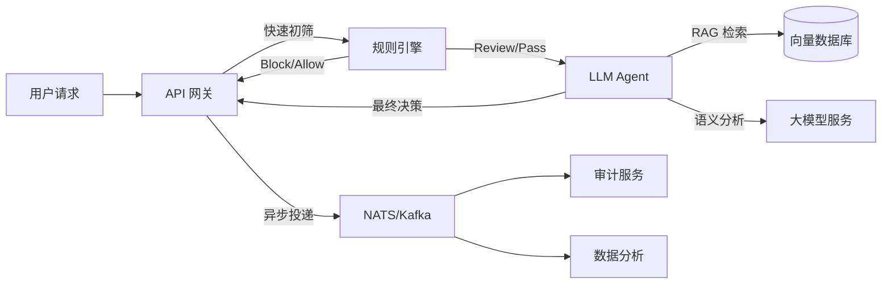

# SafeFlow 项目愿景规划文档

本文档详细定义了 SafeFlow 项目的长期发展蓝图、商业化功能补齐计划以及开源影响力最大化路线。

## 1. 项目最终效果蓝图 (Project Blueprint)

### 1.1 核心用户价值主张 (Core Value Proposition)
**"构建最灵活、高性能的企业级混合 AI 内容风控平台"**
*   **快慢结合**：结合传统规则引擎的毫秒级响应与 LLM Agent 的深度语义理解能力，实现成本与精度的完美平衡。
*   **私有化部署**：数据不出域，保障企业核心数据资产安全，完全掌控风控逻辑。
*   **可编排性**：基于 Eino 等框架的灵活编排能力，支持针对不同业务场景（直播、IM、社区）定制风控流。

### 1.2 关键使用场景 (Key Use Cases)
1.  **即时通讯 (IM) 过滤**：高并发、低延迟要求，拦截刷屏、广告、敏感词（主要靠规则引擎）。
2.  **UGC 内容社区审核**：帖子、评论的深度审核，识别隐晦的辱骂、政治隐喻、色情擦边（主要靠 LLM Agent）。
3.  **大模型输入/输出围栏 (Guardrails)**：作为企业 LLM 应用的防火墙，防止 Prompt 注入和有害内容输出。

### 1.3 视觉与交互体验标准
*   **API First**：提供 RESTful 与 gRPC 双协议接口，统一的 Response 结构。
*   **Admin Console**：
    *   **规则可视化编辑器**：拖拽式配置规则链。
    *   **实时拦截大屏**：动态展示拦截 QPS、违规分布地图。
    *   **人工复审工作台**：针对 `Review` 状态的高效审核界面，支持快捷键操作。
*   **性能基准**：
    *   规则引擎响应 < 10ms (P99)
    *   LLM Agent 响应 < 1.5s (P99, 视模型而定)
    *   系统吞吐量 > 10,000 QPS (单节点)

### 1.4 数据流程全景图

---

## 2. 商业级功能补齐清单 (Commercial-Grade Features)

### 2.1 功能模块规划

| 模块 | 功能描述 | 优先级 | 实施阶段 | 资源估算 |
| :--- | :--- | :--- | :--- | :--- |
| **多租户体系** | 数据隔离、独立配置 (`app_id` 维度)、资源配额限制 | P0 | Phase 2 | 2人/月 |
| **RBAC 权限** | 角色管理（管理员/审核员/审计员）、操作日志、SSO 集成 | P0 | Phase 2 | 1人/月 |
| **审计与合规** | 操作留痕、数据保留策略 (Retention)、GDPR/等级保护报表导出 | P1 | Phase 2 | 1人/月 |
| **Webhook 回调** | 审核结果异步通知、自定义 Headers、重试机制 | P1 | Phase 3 | 0.5人/月 |
| **可视化大屏** | 实时 QPS、违规类型分布、拦截率趋势图 (Grafana/ECharts) | P2 | Phase 3 | 1人/月 |
| **计费与订阅** | API 调用量统计、套餐管理、Stripe/支付宝集成 | P2 | Phase 4 | 2人/月 |
| **高可用灾备** | 多活部署架构、Redis/MySQL 故障自动切换、限流熔断降级 | P1 | Phase 3 | 1.5人/月 |

### 2.2 实施阶段划分
*   **Phase 1 (MVP - Current)**: 核心审核链路跑通，Docker Compose 单机部署。
*   **Phase 2 (Enterprise Core)**: 引入多租户、权限体系、持久化存储优化。
*   **Phase 3 (Scale & Ops)**: 可观测性增强、高可用架构、Webhook 系统。
*   **Phase 4 (SaaS Readiness)**: 计费系统、开发者中心、OpenAPI 平台。

---

## 3. 开源影响力最大化路线 (Open Source Strategy)

### 3.1 分层策略 (Open Core Model)
*   **Community Edition (CE)**:
    *   包含：API 网关、规则引擎核心、LLM Agent 核心、基础 Docker 部署。
    *   适用：个人开发者、初创团队、技术研究。
    *   许可证：**Apache 2.0** (宽松友好，利于推广)。
*   **Enterprise Edition (EE)**:
    *   包含：多租户管理、RBAC、高级审计报表、SSO、高可用集群部署脚本、SLA 支持。
    *   适用：中大型企业、监管合规要求高的场景。
    *   许可证：**Commercial License** (闭源/付费)。

### 3.2 代码与工程规范
*   **目录结构**：遵循 `Standard Go Project Layout`。
*   **CI/CD**：
    *   GitHub Actions：自动化 Unit Test、Linter (golangci-lint)、Docker Build。
    *   CodeQL：自动化安全扫描。
*   **文档体系**：
    *   `/docs`: 架构设计、API 参考。
    *   `README.md`: 快速开始、徽章 (Go Report, Coverage)。
    *   **官网**: 使用 Docusaurus 构建，包含多语言教程 (中/英)。

### 3.3 品牌运营与增长计划

#### 运营动作
1.  **技术博客**：在 InfoQ、掘金、Medium 发布《如何用 Go + LLM 构建高并发风控系统》系列文章。
2.  **会议演讲**：提交议题至 GopherChina, KubeCon (AI + Cloud Native track)。
3.  **高校合作**：作为开源大作业选题，吸引学生贡献者。

#### 贡献者激励 (Contributor Growth)
*   **CLA (Contributor License Agreement)**: 确保代码版权清晰。
*   **激励模型**：
    *   Level 1 (Fixer): 修复 Bug -> 官网鸣谢。
    *   Level 2 (Feature): 提交新 Feature -> 送周边 T 恤。
    *   Level 3 (Core): 长期维护模块 -> 邀请加入 Maintainer Group，即时通讯群组。

#### 阶梯目标 (Milestones)

| 时间节点 | Star 数目标 | Fork 数目标 | 核心贡献者 | 关键里程碑 |
| :--- | :--- | :--- | :--- | :--- |
| **6 个月** | 500+ | 80+ | 3-5 人 | 发布 v1.0 正式版，完善文档站 |
| **12 个月** | 2,000+ | 300+ | 10+ 人 | 被 Awesome Go 收录，落地 3-5 家标杆企业 |
| **24 个月** | 5,000+ | 800+ | 20+ 人 | 成为 Go 语言领域 AI 应用的标杆项目 |

---
*Created by SafeFlow Team*