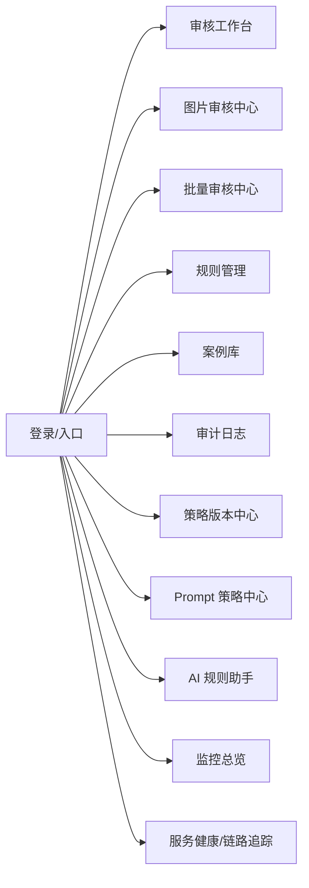
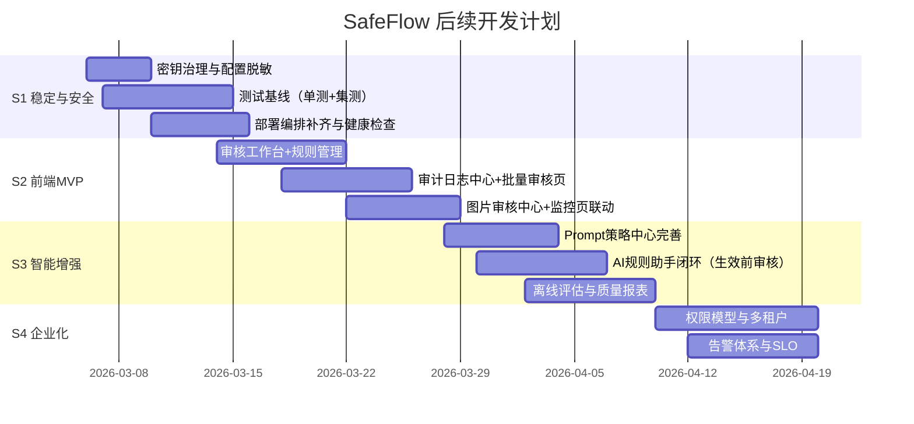

# SafeFlow 项目功能梳理与前端建设计划书（Final Plan）

## 0. 文档信息
- 报告日期：2026-03-05
- 文档版本：v1.0
- 撰写人：Chen Jiaming（AI协作）
- 审批人：待指定
- 适用范围：SafeFlow 当前代码仓库（后端实现现状 + 前端规划）

---

## 1. 项目已实现功能全景梳理（基于代码现状）

### 1.1 架构与服务现状
SafeFlow 已形成可运行的微服务审核链路，核心由以下部分组成：
1. API Gateway（统一入口，文本审核与管理后台接口）
2. Rule Engine（AC 自动机 + 正则匹配）
3. LLM Agent（Classify → RAG → Decide → Validate 多阶段流水线）
4. Image Moderation Service（火山图像审核 + OCR）
5. Audit Service（NATS 订阅审核结果并落库）
6. 可观测性体系（Prometheus + Grafana + Jaeger）

### 1.2 已落地的业务能力
- 文本单条审核：规则优先，命中直接拦截；否则进入 LLM 深度判断
- 文本批量审核：串行批量处理
- 图片审核：火山图像风险判定 + OCR 文本提取
- 审核审计：审核结果通过事件流异步落库
- 管理能力：规则管理、案例管理、审计日志查询、策略快照、Prompt 版本管理
- AI 辅助：基于违规案例自动生成候选规则
- 运维可观测：metrics 端点、Grafana 看板、Jaeger 链路追踪

### 1.3 关键接口（前端可对接）
- 业务审核
  - `POST /submit`
  - `POST /submit/batch`
  - `POST /moderate/image`（图片审核服务）
- 管理后台
  - `GET/POST/PUT/DELETE /admin/rules`
  - `GET/POST /admin/cases`
  - `GET /admin/audits`
  - `POST /admin/versions/snapshot`
  - `POST /admin/prompts`
  - `GET /admin/prompts/:scene`
  - `PUT /admin/prompts/:id/activate`
  - `POST /admin/rules/generate`
- 运维
  - `GET /metrics`
  - `GET /health`（图片服务）
  - Grafana / Jaeger（外部控制台）

---

## 2. 前端“每一个功能”的可见用途描述（详细）

> 说明：以下按“页面级功能”组织，包含用户可见价值、交互要点、数据输入输出、业务意义。

### F01 审核工作台（单条文本）
- 可见用途：审核员/运营输入一段文本，秒级得到 allow/block/review 结论
- 关键交互：输入框 + 提交按钮 + 结果卡片 + 原因说明
- 输入：`content`, `user_id`
- 输出：`action`, `reason`, `source`, `request_id`
- 业务价值：提升人工初审效率，减少误放过

### F02 批量审核中心
- 可见用途：一次提交多条内容，统一查看批处理结果
- 关键交互：多行输入/文件导入、批次提交、结果列表导出
- 输入：`batch_id`, `contents[]`, `user_id`
- 输出：每条内容的动作、来源、错误信息
- 业务价值：适用于活动期间高并发运营巡检

### F03 图片审核中心
- 可见用途：输入图片 URL，查看风险分、标签、OCR 文本与最终动作
- 关键交互：图片预览、场景选择（ugc/ad/profile）、结果可视卡片
- 输入：`image_url`, `scene`
- 输出：`action`, `risk_score`, `labels`, `text_content`, `ocr_result`, `reason`
- 业务价值：覆盖图文合规风险，支持“图中文字违规”识别

### F04 规则管理台（Rule Studio）
- 可见用途：运营可视化创建、修改、启停规则
- 关键交互：规则列表筛选、优先级编辑、类型切换（keyword/regex）
- 输入：`pattern/type/action/group/priority/is_enabled/description`
- 输出：规则清单与状态
- 业务价值：实现规则快速迭代，不依赖研发改代码

### F05 案例库管理
- 可见用途：维护历史案例，支持后续 AI/RAG 能力增强
- 关键交互：新增案例、标签分类、时间排序
- 输入：`content/label/category`
- 输出：案例列表
- 业务价值：沉淀组织知识，提升模型判定一致性

### F06 审计日志中心
- 可见用途：查询每次审核轨迹，支持按用户/动作/来源过滤
- 关键交互：筛选器 + 分页 + 详情抽屉
- 输入：`user_id/action/source/page/page_size`
- 输出：`request_id/user_id/action/reason/source/created_at`
- 业务价值：复盘争议内容，支撑合规追责与管理报表

### F07 策略版本中心（快照）
- 可见用途：一键保存当前规则快照，形成“可回溯版本”
- 关键交互：创建快照、版本列表、版本说明
- 输入：当前启用规则集合
- 输出：`PolicyVersion(type=rule)` 记录
- 业务价值：变更可追踪，可支撑审计与回滚

### F08 Prompt 策略中心
- 可见用途：按场景维护系统提示词并激活版本
- 关键交互：场景筛选、版本创建、激活切换、版本对比（规划）
- 输入：`scene/system_prompt/temperature/max_tokens/tools/comment`
- 输出：Prompt 版本历史与激活状态
- 业务价值：让审核策略像配置一样管理，降低“黑盒变更”风险

### F09 AI 规则助手
- 可见用途：基于历史违规案例自动生成候选规则，供人工确认
- 关键交互：类别选择、生成预览、一键采纳/退回
- 输入：`category`
- 输出：`generated_count/valid_count/rules[]`
- 业务价值：加速规则生产，提高覆盖率与迭代速度

### F10 监控总览页（可嵌入 Grafana）
- 可见用途：实时查看请求量、动作分布、延迟、LLM 调用、规则命中
- 关键交互：时间窗切换、指标联动、异常高亮
- 输出：Prometheus 指标可视化
- 业务价值：发现系统瓶颈与异常，辅助容量规划

### F11 服务健康页
- 可见用途：展示关键服务存活状态与依赖可用性
- 关键交互：健康状态灯（绿/黄/红）+ 最近异常提示
- 输出：`/health`、指标端点状态
- 业务价值：运维人员快速定位故障点

### F12 链路追踪页（跳转 Jaeger）
- 可见用途：查看单请求跨服务调用路径与耗时分布
- 关键交互：按 request_id 检索 trace
- 业务价值：定位慢调用、识别降级触发原因

---

## 3. 前端信息架构建议（IA）

---

## 4. 当前差距与优化优先级

### P0（必须优先）
1. 安全治理：密钥脱敏、禁止日志打印敏感信息
2. 测试体系：建立单元测试/集成测试基线
3. 部署一致性：补齐 docker-compose 中缺失服务编排

### P1（高优先）
1. 前端管理台首版（规则、审计、单条审核）
2. 批量审核异步化（任务状态可查询）
3. 图片审核在网关统一接入（减少多入口割裂）

### P2（中优先）
1. Prompt 版本 diff 能力
2. OCR 多语言与质量指标
3. 细粒度权限与多租户能力

---

## 5. 接下来的优化及开发计划（计划书）

## 5.1 目标与阶段划分
- 阶段 S1：稳定性与安全收口
- 阶段 S2：前端 MVP（运营可用）
- 阶段 S3：智能化增强与治理体系
- 阶段 S4：规模化与企业化能力

## 5.2 里程碑甘特图

## 5.3 分阶段关键交付物与验收标准

### S1 交付物
- 交付物：密钥治理方案、测试用例集、统一部署清单
- 验收标准：
  - 配置文件无明文敏感信息
  - 核心路径测试通过率 ≥ 95%
  - 一键启动后核心服务均可健康检查通过

### S1 详细开发计划（执行版）

#### S1-1 目标拆解
- G1 安全收口：完成敏感配置脱敏、日志脱敏、密钥轮换
- G2 质量基线：建立可重复执行的测试流程与覆盖率门槛
- G3 部署一致性：补齐缺失服务编排、健康检查、启动依赖
- G4 验收闭环：形成检查清单与发布前阻断机制

#### S1-2 工作流与任务包
- W1 安全治理任务包
  - 任务1：配置分层改造（`.env.example` + 运行时环境变量注入）
  - 任务2：全仓敏感字段排查（AK/SK/DSN/Token）并替换占位符
  - 任务3：日志脱敏（禁止输出密钥、凭证、完整连接串）
  - 任务4：密钥轮换执行与回归验证（图像审核/OCR/LLM 关键链路）
  - 交付件：`安全整改清单`、`脱敏前后对照表`、`轮换记录`
- W2 测试基线任务包
  - 任务1：为 `rule`、`agent`、`imagemod` 增加单元测试入口
  - 任务2：补充网关核心接口集成测试（`/submit`、`/submit/batch`、管理接口）
  - 任务3：固化测试命令（本地与 CI 一致）
  - 任务4：定义最低门槛（通过率、关键路径覆盖）
  - 交付件：`测试清单`、`失败用例回归记录`、`质量门禁规则`
- W3 部署治理任务包
  - 任务1：补齐 compose 服务（image-moderation、audit-service）
  - 任务2：增加健康检查、重启策略、启动依赖顺序
  - 任务3：统一端口与环境变量命名，消除多入口歧义
  - 任务4：完成一键启动与最小可用演练
  - 交付件：`部署清单`、`依赖拓扑图`、`一键启动说明`
- W4 发布与验收任务包
  - 任务1：建立 S1 发布前检查表（安全/测试/部署三线）
  - 任务2：执行灰度演练与回滚演练
  - 任务3：输出 S1 阶段复盘（问题、根因、改进项）
  - 交付件：`S1验收报告`、`发布记录`、`回滚预案`

#### S1-3 周度排期（建议）
- 第 1 周（安全治理优先）
  - 完成 W1 任务1~3
  - 完成 W3 任务1
  - 形成首版安全整改清单
- 第 2 周（质量与部署并行）
  - 完成 W2 任务1~3
  - 完成 W3 任务2~4
  - 输出一键启动演练结果
- 第 3 周（验收与发布）
  - 完成 W1 任务4 与 W2 任务4
  - 完成 W4 全部任务
  - 形成 S1 验收报告并进入 S2

#### S1-4 量化验收口径（Definition of Done）
- 安全口径
  - 代码仓库与配置文件中无明文密钥
  - 服务启动日志不输出敏感字段
  - 完成至少一次密钥轮换并通过回归
- 质量口径
  - 核心链路测试通过率达到目标门槛
  - 关键接口有自动化回归用例
  - 测试命令可在本地与 CI 稳定复现
- 部署口径
  - `docker-compose` 可拉起完整核心链路
  - 核心服务健康检查全部通过
  - 异常场景具备回滚路径

#### S1-5 风险前置与阻断机制
- R1 若发现明文密钥未清理，阻断发布
- R2 若核心链路测试未达标，阻断发布
- R3 若一键启动演练失败，阻断发布
- R4 若回滚预案未验证，阻断发布

### S1 执行完成情况（已落实）
- 安全治理
  - 已移除图片审核服务中的密钥明文日志输出，改为布尔状态日志
  - 已清理 `config.yaml` 中的真实 `ARK_API_KEY` 值
  - 已新增 `.env.example` 作为标准化环境变量模板
- 测试基线
  - 已新增 `internal/rule/ahocorasick_test.go`
  - 已新增 `internal/llmagent/handler_test.go`
  - 已新增 `internal/imagemod/volcengine_client_test.go`
  - 已修复 `Box` 结构体重复 JSON Tag 问题，确保静态检查通过
- 部署治理
  - 已补齐 `image-moderation` 与 `audit-service` 的 Docker 构建与编排
  - 已为 `api-gateway`、`rule-engine`、`llm-agent`、`audit-service` 增加健康检查入口
  - 已为核心容器补充 `healthcheck` 与关键依赖关系
- 验收结果
  - `go test ./...` 通过
  - `go vet ./...` 通过
  - `docker compose config` 校验通过

### S2 交付物
- 交付物：前端 MVP（F01/F02/F03/F04/F06/F10）
- 验收标准：
  - 审核结果可视化完整（动作+理由+来源）
  - 规则 CRUD 全流程可操作
  - 审计查询支持分页与多条件筛选

### S3 交付物
- 交付物：Prompt 策略中心、AI 规则建议闭环、离线评估报告
- 验收标准：
  - Prompt 可按场景版本化切换
  - AI 建议规则支持人工确认后发布
  - 输出准确率/误杀率/放过率等评估指标

### S4 交付物
- 交付物：RBAC、多租户、告警SLO
- 验收标准：
  - 用户角色分权生效
  - 租户数据隔离验证通过
  - 告警触发与升级策略可演练

---

## 6. 前端功能优先级清单（建议实现顺序）

1. 审核工作台（F01）
2. 规则管理台（F04）
3. 审计日志中心（F06）
4. 图片审核中心（F03）
5. 批量审核中心（F02）
6. 策略版本中心（F07/F08）
7. AI规则助手（F09）
8. 监控与健康页（F10/F11/F12）

---

## 7. 风险与应对（开发执行版）

- 风险：后端接口字段变化导致前端返工  
  - 应对：冻结接口契约，维护 OpenAPI/字段变更清单
- 风险：LLM/OCR 外部服务抖动  
  - 应对：前端展示“降级状态提示 + 可重试入口”
- 风险：缺乏统一设计规范导致页面割裂  
  - 应对：先制定组件规范与交互标准（表单、表格、状态色）
- 风险：计划过满导致延期  
  - 应对：按 P0/P1/P2 严格裁剪范围，优先交付闭环能力

---

## 8. 本文档结论
SafeFlow 已具备“可运行的审核后端主干能力”，下一阶段应以“前端可用性建设 + 工程化收口”为主线推进。建议优先实现运营可直接使用的审核与管理页面，随后补齐策略治理与智能化闭环，最终过渡到企业级能力（权限、多租户、SLO）。
