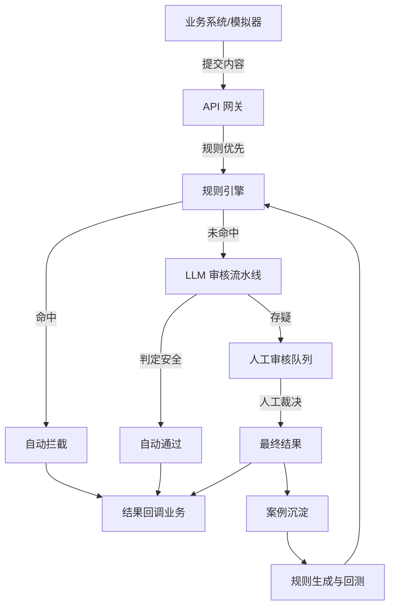

# SafeFlow 审核系统新计划书（面向可运营的真实业务）

## 0. 文档信息
- 报告日期：2026-03-06
- 文档版本：v2.0
- 适用范围：SafeFlow 全链路（审核接入、人工复审、策略治理、反馈闭环）

---

## 1. 项目最终形态定义

### 1.1 产品定位
SafeFlow 的最终形态是一个**“人机协作的审核系统”**，目标不是展示模型能力，而是**稳定处理持续流入的内容流**，实现以下闭环：
- 大部分内容自动处理
- 少量疑难内容进入人工队列
- 人工结果反哺规则与模型
- 规则与模型迭代后提高自动化覆盖

### 1.2 目标用户与价值
- 运营审核员：高效处理疑难内容，减少重复劳动
- 规则运营：安全试错、可回溯、可回测
- 业务方：稳定、低延迟、可解释的审核决策

---

## 2. 业务逻辑主干

### 2.1 真实审核系统必备的流动逻辑
1. 内容流入（业务系统或模拟流量）
2. 自动审核（规则优先 + AI 深度判断）
3. 结果分流（通过 / 拦截 / 人工复审）
4. 人工复审队列（可视、可操作、可追踪）
5. 结果回传业务（展示/删除/拦截）
6. 结果沉淀与闭环（案例库、规则优化、Prompt 调整）

### 2.2 系统流程图

---

## 3. 功能结构重构

### 3.1 必备模块（核心链路）
1. **内容入口**：真实接口 + 模拟流量发生器
2. **审核流水线**：规则优先、模型兜底
3. **人工审核队列**：可处理 review 样本
4. **回调与业务展示**：审核结果反馈到业务侧
5. **案例沉淀**：人工结果结构化存储
6. **规则治理与回测**：规则上线前影响评估

### 3.2 辅助模块（可视与治理）
- 审计日志中心
- 监控与指标大屏
- Prompt 策略管理

---

## 4. 前端最终形态规划（从页面到价值）

### 4.1 模拟业务流页面（Sim Social）
- 功能：发布内容、展示通过内容
- 价值：让系统像真实业务一样流动起来

### 4.2 审核运营台（Review Inbox）
- 功能：展示 review 队列，支持快速裁决
- 价值：承载人工审核的真实工作流

### 4.3 规则治理台（Rule Studio）
- 功能：规则增删改、启停、优先级、回测
- 价值：让规则迭代有依据、可回溯

### 4.4 审计日志中心
- 功能：按时间、用户、动作检索
- 价值：对外解释与合规复盘

### 4.5 监控总览页
- 功能：请求量、动作分布、耗时、模型调用
- 价值：保障系统稳定性

---

## 5. 新执行路线图

### 阶段 S1：让审核系统“能跑起来”
- 建立模拟流量源
- 接通审核流水线与业务展示
- 形成“内容进来 → 自动判定 → 展示/拦截”的闭环

### 阶段 S2：让人工审核“能工作”
- 完成 review 队列
- 支持人工裁决与回传
- 沉淀人工案例

### 阶段 S3：让策略“能进化”
- 规则回测与上线流程
- Prompt 策略版本化
- 评估与质检指标

---

## 6. 交付验收标准

### 6.1 系统完整性
- 内容可通过模拟源持续流入
- 自动审核与人工审核均可执行
- 审核结果可回传至业务界面

### 6.2 可解释性
- 每条审核结果含原因与来源
- 审计日志可检索可追踪

### 6.3 可进化性
- 人工裁决可沉淀为案例
- 规则可回测再上线

---

## 7. 结论
SafeFlow 的核心不是“演示审核功能”，而是**建立一个真实可运转的审核系统闭环**。只有当内容流、人工介入与策略进化形成统一链路时，它才真正有业务价值。
